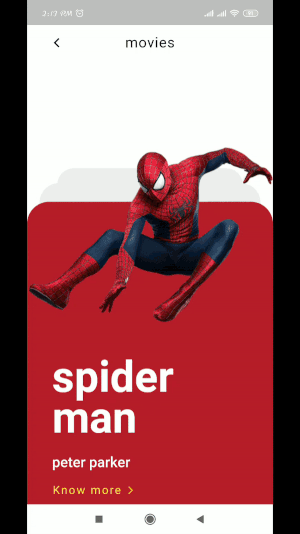

# super_hero_interaction

Super Hero Interaction developed in Flutter, design inspired from [here](https://dribbble.com/shots/5935613-Marvel-Movies-Interaction)

 

### If you :heart: the effort then star :star: it.

## Credits
- Super hero character images source from [pngimg.com](http://pngimg.com/license)

## Please Contribute
1. Fork the the project
2. Create your feature branch (git checkout -b my-new-feature)
3. Make required changes and commit (git commit -am 'Add some feature')
4. Push to the branch (git push origin my-new-feature)
5. Create new Pull Request

## Getting Started with Flutter

For help getting started with Flutter, view online
[documentation](https://flutter.io/)

## License
Copyright 2019 Pinkesh Darji

Licensed under the Apache License, Version 2.0 (the "License"); you may not use this file except in compliance with the License. You may obtain a copy of the License at

http://www.apache.org/licenses/LICENSE-2.0

Unless required by applicable law or agreed to in writing, software distributed under the License is distributed on an "AS IS" BASIS, WITHOUT WARRANTIES OR CONDITIONS OF ANY KIND, either express or implied. See the License for the specific language governing permissions and limitations under the License.
